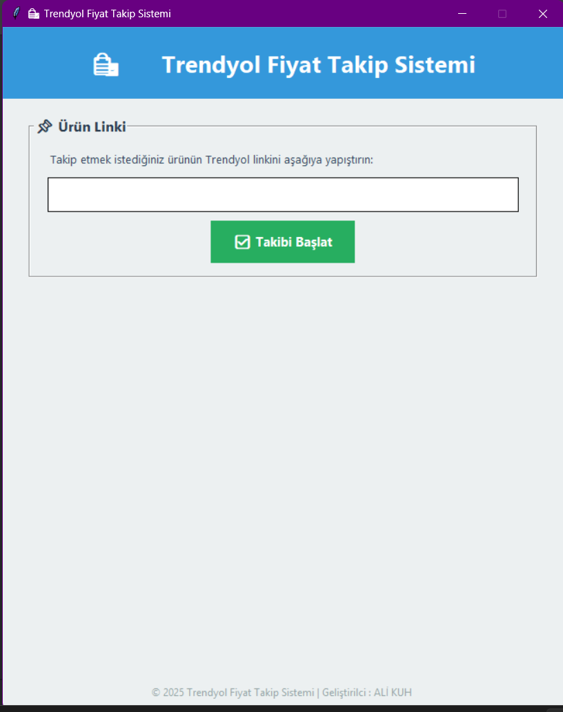
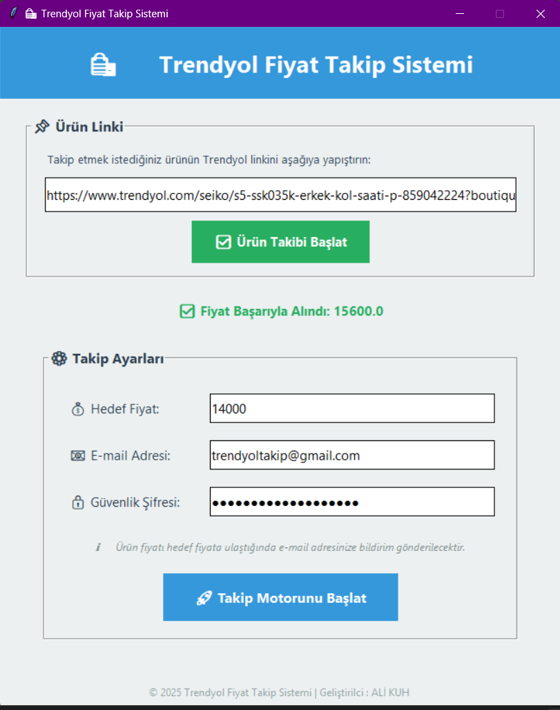

# 🛍️ Trendyol Fiyat Takip Sistemi


Bu proje, Trendyol üzerindeki seçtiğiniz ürünlerin fiyatını otomatik olarak takip eden ve belirlediğiniz hedef fiyatın altına düştüğünde size **E-Posta** yoluyla bildirim gönderen bir masaüstü otomasyon uygulamasıdır.

<p align="center">
  
  
</p>

## 🌟 Özellikler

* **Kullanıcı Dostu Arayüz:** Tkinter ile hazırlanmış modern ve anlaşılır arayüz.
* **Otomatik Fiyat Çekme:** Selenium kullanarak Trendyol ürün sayfasındaki güncel fiyatı anlık olarak çeker.
* **Akıllı Pop-up Yönetimi:** Ürün sayfalarında çıkan reklam ve bilgilendirme pop-up'larını otomatik kapatır.
* **Arka Plan Modu:** Tarayıcıyı "Headless" (gizli) modda çalıştırarak sizi rahatsız etmez.
* **E-Posta Bildirimi:** Ürün fiyatı, hedeflediğiniz fiyata düştüğünde anında mail atar.
* **Periyodik Kontrol:** Sistem her 10 dakikada bir fiyatı otomatik olarak kontrol eder.

## 🛠️ Kurulum

Projeyi bilgisayarınızda çalıştırmak için aşağıdaki adımları izleyin:

1.  **Repoyu Klonlayın:**
    ```bash
    git clone [https://github.com/alikuh/Trendyol_FiyatTakip.git](https://github.com/alikuh/Trendyol_FiyatTakip.git)
    cd Trendyol_FiyatTakip
    ```

2.  **Gerekli Kütüphaneleri Yükleyin:**
    Terminal veya komut satırına şu komutu yazarak gerekli paketleri yükleyin:
    ```bash
    pip install selenium webdriver-manager
    ```
    *(Not: Tkinter Python ile birlikte yüklü gelir, ekstra kuruluma gerek yoktur.)*

3.  **Dosya Yapılandırması:**
    Projenin düzgün çalışması için kodlarınızın şu dosya isimlerinde olduğundan emin olun (veya `import` kısımlarını düzenleyin):
    * `selenium_file.py`: Selenium sınıfının bulunduğu dosya.
    * `main.py`: Arayüzün (GUI) bulunduğu ana çalıştırılabilir dosya.

## 🚀 Kullanım

1.  `main.py` dosyasını çalıştırın.
2.  **Ürün Linki** alanına Trendyol'dan kopyaladığınız ürün linkini yapıştırın ve **"Takibi Başlat"** butonuna basın.
3.  Uygulama anlık fiyatı çekecektir. Fiyat geldikten sonra ayarlar paneli açılır.
4.  **Hedef Fiyat:** Ürünü almak istediğiniz maksimum fiyatı girin.
5.  **E-mail Adresi:** Bildirimin geleceği (ve gönderim yapacak olan) Gmail adresinizi girin.
6.  **Güvenlik Şifresi:** Aşağıdaki "Önemli Not" kısmında belirtilen **Uygulama Şifresini** girin.
7.  **"Takip Motorunu Başlat"** butonuna tıklayın.

## ⚠️ Önemli Not: Gmail Ayarları

Google güvenlik politikaları gereği, bu tarz yazılımlarda normal Gmail şifrenizi kullanamazsınız. Bunun yerine bir **Uygulama Şifresi (App Password)** oluşturmalısınız:

1.  Google Hesabım > Güvenlik > 2 Adımlı Doğrulama'yı açın.
2.  Arama çubuğuna "Uygulama Şifreleri" yazın.
3.  Yeni bir uygulama şifresi oluşturun (Adına "TrendyolTakip" diyebilirsiniz).
4.  Size verilen 16 haneli şifreyi programdaki "Güvenlik Şifresi" alanına yapıştırın.

## 📂 Proje Yapısı

* `main.py`: Kullanıcı arayüzü ve ana döngü işlemleri.
* `selenium_file.py`: Web scraping ve mail gönderme işlemlerini yürüten backend sınıfı (`FiyatTakip`).

## 👨‍💻 Geliştirici

**Ali KUH**
* GitHub: [@alikuh](https://github.com/alikuh)

---
*Bu proje eğitim amaçlı geliştirilmiştir.*
